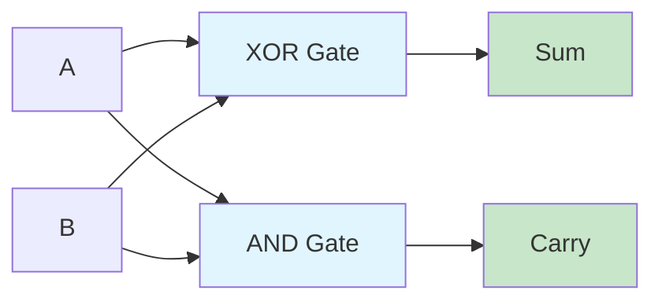
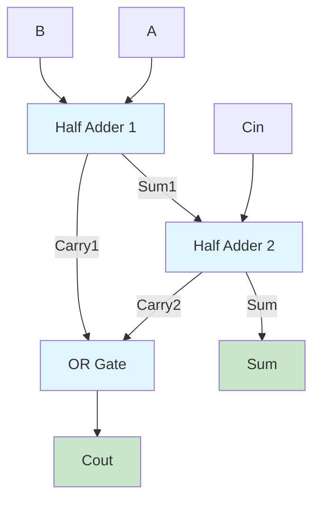
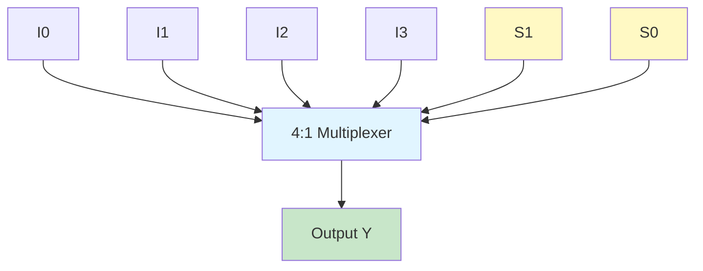
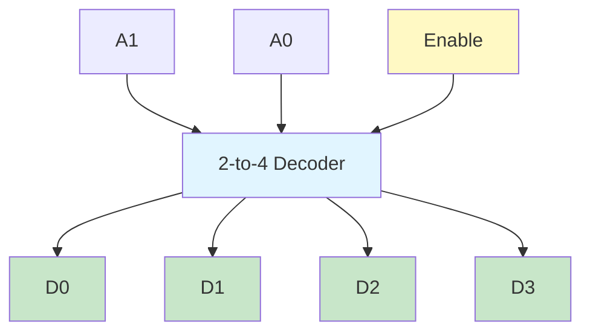
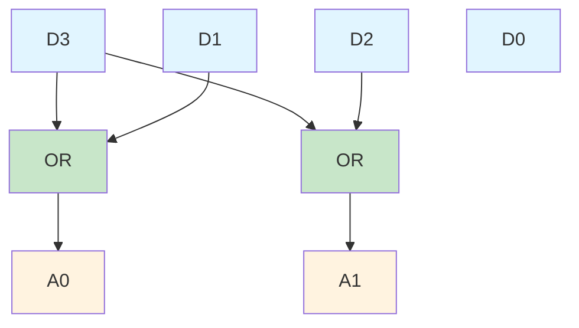

# Combinational Circuits

## Overview

A combinational circuit is a digital circuit where the output depends only on the present input values, not on past inputs. These circuits consist of logic gates whose outputs are determined solely by the current combination of inputs.

### Key Characteristics
- No memory elements
- Output is a function of present input only
- No feedback paths
- Can be described by Boolean functions
- Design follows systematic procedures

## Design Procedure

1. **Problem Statement**: Identify the requirements
2. **Input/Output Variables**: Determine number and type of variables
3. **Truth Table**: Construct the truth table
4. **Boolean Functions**: Write SOP or POS expressions
5. **Simplification**: Minimize using K-maps or Boolean algebra
6. **Logic Diagram**: Draw the final circuit

## Types of Combinational Circuits

### 1. Arithmetic Circuits
- Half Adder
- Full Adder  
- Half Subtractor
- Full Subtractor
- Binary Adders (Ripple Carry, Carry Look-ahead)
- BCD Adder

### 2. Code Converters
- Binary to Gray
- Gray to Binary
- BCD Converters

### 3. Data Selectors/Distributors
- Multiplexers (MUX)
- Demultiplexers (DEMUX)

### 4. Encoders/Decoders
- Binary Encoders
- Priority Encoders
- Binary Decoders
- BCD to 7-Segment Decoders

### 5. Comparators
- Magnitude Comparators
- Equality Detectors

## Half Adder

A half adder adds two single binary digits and produces Sum and Carry outputs.

**Truth Table:**
```
A  B | Sum  Carry
0  0 |  0    0
0  1 |  1    0
1  0 |  1    0  
1  1 |  0    1
```

**Boolean Expressions:**
- Sum = A ⊕ B (XOR operation)
- Carry = A · B (AND operation)

**Components:** 1 XOR gate, 1 AND gate

**Circuit Diagram:**



## Full Adder

A full adder adds three binary digits (two significant bits and a carry-in) and produces Sum and Carry-out.

**Truth Table:**
```
A  B  Cin | Sum  Cout
0  0  0   |  0    0
0  0  1   |  1    0
0  1  0   |  1    0
0  1  1   |  0    1
1  0  0   |  1    0
1  0  1   |  0    1
1  1  0   |  0    1
1  1  1   |  1    1
```

**Boolean Expressions:**
- Sum = A ⊕ B ⊕ Cin
- Cout = A·B + Cin(A⊕B) = A·B + B·Cin + A·Cin

**Implementation:**
- Using 2 Half Adders and 1 OR gate
- Direct implementation with gates

**Circuit Diagram:**



## Binary Adders

### Ripple Carry Adder (RCA)
- Connects multiple full adders in cascade
- Carry propagates from LSB to MSB
- Simple but slow (carry ripple delay)
- n-bit RCA requires n full adders
- Total delay = n × (delay of 1 FA)

### Carry Look-Ahead Adder (CLA)
- Eliminates carry propagation delay
- Generates all carries in parallel
- Uses Generate (G) and Propagate (P) signals

**Generate:** Gi = Ai · Bi (always produces carry)
**Propagate:** Pi = Ai ⊕ Bi (propagates carry if present)

**Carry Equations:**
- C1 = G0 + P0·C0
- C2 = G1 + P1·G0 + P1·P0·C0  
- C3 = G2 + P2·G1 + P2·P1·G0 + P2·P1·P0·C0
- C4 = G3 + P3·G2 + P3·P2·G1 + P3·P2·P1·G0 + P3·P2·P1·P0·C0

**Advantages:**
- Faster than RCA
- Fixed delay regardless of bit width
- Suitable for high-speed applications

## BCD Adder

Adds two BCD digits and produces result in BCD format.

**Correction Logic:**
- If binary sum > 9 (1001) or Cout = 1
- Add 0110 (6) to correct the result
- Generate carry for next stage

**Correction Condition:** C = K + Z8·Z4 + Z8·Z2
where K = carry out, Z8Z4Z2Z1 = binary sum

## Half Subtractor

Subtracts two binary digits producing Difference and Borrow.

**Boolean Expressions:**
- Difference = A ⊕ B
- Borrow = A'·B

## Full Subtractor

Subtracts three binary digits (minuend, subtrahend, borrow-in).

**Boolean Expressions:**
- Difference = A ⊕ B ⊕ Bin
- Bout = A'·B + Bin(A⊕B)' = A'·B + A'·Bin + B·Bin

## Multiplexer (MUX)

A multiplexer selects one of many input data lines and forwards it to a single output line based on select inputs.

### Characteristics
- 2^n input lines
- n select lines
- 1 output line
- Called "data selector" or "many-to-one circuit"

### Common Types
- 2:1 MUX (1 select line)
- 4:1 MUX (2 select lines)  
- 8:1 MUX (3 select lines)
- 16:1 MUX (4 select lines)

**4:1 MUX Output:**
Y = S1'·S0'·I0 + S1'·S0·I1 + S1·S0'·I2 + S1·S0·I3

**4:1 MUX Block Diagram:**



### MUX as Universal Gate
Multiplexers can implement any Boolean function:
- Connect variables to select lines
- Apply appropriate values (0, 1, variable, complement) to data inputs

**For n-variable function:**
- Use 2^(n-1):1 MUX with (n-1) variables on select lines
- Or use 2^n:1 MUX with all n variables on select lines

## Demultiplexer (DEMUX)

A demultiplexer routes a single input to one of many output lines based on select inputs.

### Characteristics  
- 1 input line
- n select lines
- 2^n output lines
- Called "data distributor" or "one-to-many circuit"

**Note:** A decoder with enable acts as a DEMUX

## Decoder

Converts n-bit binary input to maximum 2^n unique output lines.

### Types
- 2-to-4 decoder
- 3-to-8 decoder
- 4-to-16 decoder
- BCD to Decimal decoder
- BCD to 7-Segment decoder

**n-to-2^n Decoder:**
- Generates all 2^n minterms
- Only one output is active for each input combination
- Can implement any Boolean function using OR gates

**With Enable:**
- Active-high enable: Output active when E=1
- Active-low enable: Output active when E=0

**2-to-4 Decoder Block Diagram:**



## Encoder

Converts 2^n input lines to n-bit binary output (inverse of decoder).

**Truth Table (4-to-2 Encoder):**

```
Inputs          | Outputs
D3 D2 D1 D0     | A1 A0
0  0  0  1      | 0  0
0  0  1  0      | 0  1  
0  1  0  0      | 1  0
1  0  0  0      | 1  1
```

**Circuit Diagram:**

A 4-to-2 encoder can be implemented using OR gates:
- Output A0 = D1 + D3
- Output A1 = D2 + D3



## Magnitude Comparator

Compares two binary numbers and determines their relationship.

**Outputs:**
- A > B
- A = B  
- A < B

**1-bit Comparator:**
- A > B = A·B'
- A = B = A'·B' + A·B = A⊙B
- A < B = A'·B

**n-bit Comparator:**
- Compare MSBs first
- If equal, compare next bits
- Continue until difference found
- Cascadable for larger bit widths

## Implementation Techniques

### 1. Using Basic Gates
- AND, OR, NOT gates
- NAND gates only
- NOR gates only

### 2. Using MUX
- Universal implementation
- Efficient for complex functions
- Reduces gate count

### 3. Using Decoders + OR Gates
- Implement any SOP function
- Good for multiple outputs

## Important Design Considerations

### Propagation Delay
- Time for output to respond to input change
- Critical in high-speed circuits
- Cumulative in cascaded circuits

### Fan-out
- Number of gates an output can drive
- Important for loading calculations

### Power Consumption
- Static power (leakage)
- Dynamic power (switching)

### Area/Cost
- Gate count
- Interconnections
- Design complexity

## Applications

### Data Processing
- ALU (Arithmetic Logic Unit)
- Calculator circuits
- Data converters

### Communication Systems
- Data routing
- Channel selection
- Protocol conversion

### Control Systems  
- Address decoding
- Device selection
- Priority resolution

### Computing
- CPU components
- Memory addressing
- I/O interfaces

## Important Notes

1. **No Feedback:** Combinational circuits never have feedback paths (output to input)

2. **Timing:** All outputs settle to stable values after propagation delay

3. **Hazards:** May produce temporary glitches during transitions
   - Static hazard: unwanted pulse when output should be steady
   - Dynamic hazard: multiple transitions when output changes

4. **Design Trade-offs:**
   - Speed vs. Power
   - Area vs. Performance  
   - Complexity vs. Functionality

5. **Testing:** Requires 2^n test vectors for n inputs

6. **Optimization Goals:**
   - Minimize gates
   - Minimize levels
   - Minimize delay
   - Minimize power

## Common Design Patterns

### Majority Detector
- Output 1 if majority of inputs are 1
- For 3 inputs: F = AB + BC + CA
- Self-dual function

### Even/Odd Parity Generator  
- Even: P = A ⊕ B ⊕ C ⊕ D
- Odd: P = (A ⊕ B ⊕ C ⊕ D)'
- Used in error detection

### Code Converters
- Binary to BCD
- BCD to Excess-3
- Binary to Gray: Gi = Bi ⊕ Bi+1
- Gray to Binary: Bi = Bi+1 ⊕ Gi

## Resources

- Digital Design by M. Morris Mano
- Practice designing circuits systematically
- Verify designs using truth tables
- Simulate before hardware implementation
- Understand timing diagrams
