# Sequential Circuits

## Overview

Sequential circuits are digital circuits whose outputs depend on both present inputs and past history of inputs. Unlike combinational circuits, sequential circuits have memory elements that store information about previous states.

### Key Characteristics

- **Memory Elements**: Store binary information
- **State**: Determined by stored information
- **Output**: Function of both present input and present state
- **Feedback**: Uses feedback paths to maintain state
- **Clock**: May be synchronous (clocked) or asynchronous

---

## LATCHES

Latches are level-triggered memory devices that change state based on control signal levels.

### 1. SR Latch (Set-Reset Latch)

#### Using NOR Gates

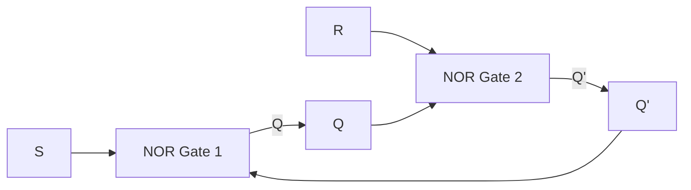

#### Truth Table (NOR-based SR Latch)

| S | R | Q(t+1) | State |
|---|---|--------|------------------|
| 0 | 0 | Q(t)   | Hold/No Change   |
| 0 | 1 | 0      | Reset            |
| 1 | 0 | 1      | Set              |
| 1 | 1 | X      | Invalid/Forbidden|

#### Using NAND Gates

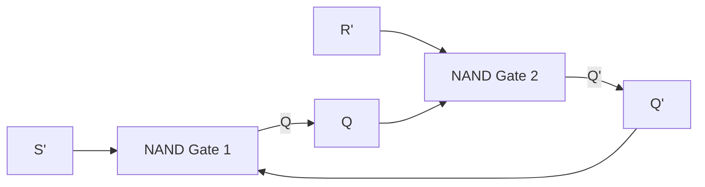

#### Truth Table (NAND-based SR Latch)

| S' | R' | Q(t+1) | State |
|----|----|---------|-----------------|
| 0  | 0  | X       | Invalid/Forbidden |
| 0  | 1  | 1       | Set               |
| 1  | 0  | 0       | Reset             |
| 1  | 1  | Q(t)    | Hold/No Change    |

---

### 2. D Latch (Data/Delay Latch)

#### Circuit Diagram

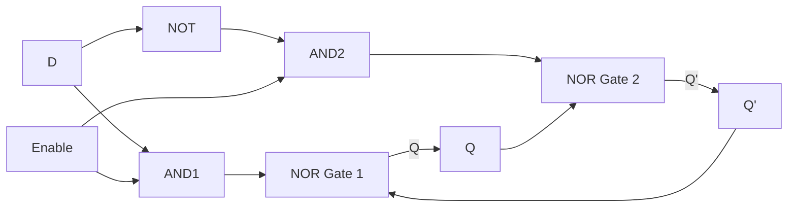

#### Truth Table

| Enable | D | Q(t+1) | State |
|--------|---|--------|------------------|
| 0      | X | Q(t)   | Hold/No Change   |
| 1      | 0 | 0      | Reset            |
| 1      | 1 | 1      | Set              |

**Characteristic Equation**: Q(t+1) = D (when Enable = 1)

---

### 3. JK Latch

#### Circuit Diagram

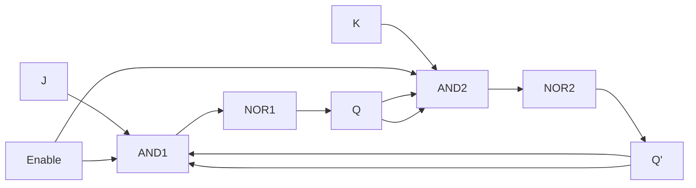

#### Truth Table

| Enable | J | K | Q(t+1) | State |
|--------|---|---|--------|-----------------|
| 0      | X | X | Q(t)   | Hold/No Change  |
| 1      | 0 | 0 | Q(t)   | Hold/No Change  |
| 1      | 0 | 1 | 0      | Reset           |
| 1      | 1 | 0 | 1      | Set             |
| 1      | 1 | 1 | Q'(t)  | Toggle          |

**Characteristic Equation**: Q(t+1) = JQ' + K'Q

---

## Advantages and Disadvantages of Latches

### Advantages

1. **Simple Design**: Fewer components compared to flip-flops
2. **Fast Response**: No clock required, immediate response to input changes
3. **Low Power**: Generally consume less power
4. **Transparent Operation**: Output follows input when enabled
5. **Area Efficient**: Occupy less chip area

### Disadvantages

1. **Timing Issues**: Level-sensitive, can cause race conditions
2. **Difficult to Synchronize**: Hard to control in large systems
3. **Glitches**: Susceptible to noise and spurious transitions
4. **No Clock Synchronization**: Cannot be easily integrated in synchronous systems
5. **Setup/Hold Issues**: Transparent nature can lead to timing violations

---

## FLIP-FLOPS

Flip-flops are edge-triggered memory devices that change state only at clock transitions (rising or falling edge).

### 1. SR Flip-Flop (Set-Reset Flip-Flop)

#### Circuit Diagram

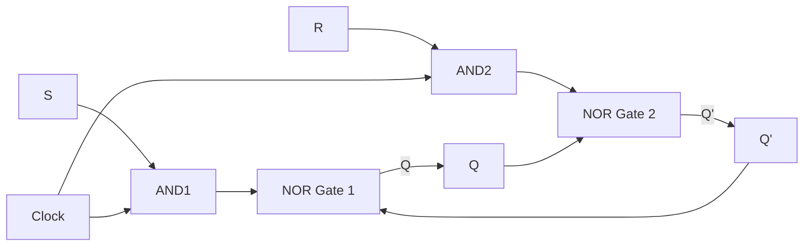

#### Truth Table

| CLK | S | R | Q(t+1) | State |
|-----|---|---|--------|-----------------|
| ↑   | 0 | 0 | Q(t)   | Hold/No Change  |
| ↑   | 0 | 1 | 0      | Reset           |
| ↑   | 1 | 0 | 1      | Set             |
| ↑   | 1 | 1 | X      | Invalid/Forbidden|
| 0/1 | X | X | Q(t)   | No Change       |

#### Characteristic Table

| S | R | Q(t) | Q(t+1) |
|---|---|------|--------|
| 0 | 0 | 0 | 0 |
| 0 | 0 | 1 | 1 |
| 0 | 1 | 0 | 0 |
| 0 | 1 | 1 | 0 |
| 1 | 0 | 0 | 1 |
| 1 | 0 | 1 | 1 |
| 1 | 1 | 0 | X |
| 1 | 1 | 1 | X |

**Characteristic Equation**: Q(t+1) = S + R'Q(t)

#### Excitation Table (Input-Output Relationship)

| Q(t) | Q(t+1) | S | R |
|------|--------|---|---|
| 0 | 0 | 0 | X |
| 0 | 1 | 1 | 0 |
| 1 | 0 | 0 | 1 |
| 1 | 1 | X | 0 |

---

### 2. D Flip-Flop (Data/Delay Flip-Flop)

#### Circuit Diagram

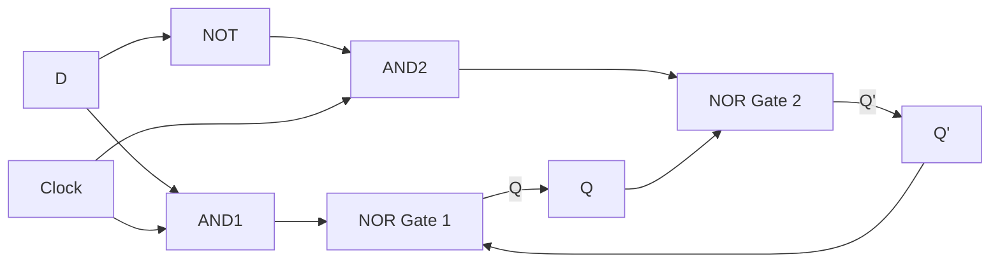

#### Truth Table

| CLK | D | Q(t+1) | State |
|-----|---|--------|----------------|
| ↑   | 0 | 0      | Reset          |
| ↑   | 1 | 1      | Set            |
| 0/1 | X | Q(t)   | No Change      |

#### Characteristic Table

| D | Q(t) | Q(t+1) |
|---|------|--------|
| 0 | 0 | 0 |
| 0 | 1 | 0 |
| 1 | 0 | 1 |
| 1 | 1 | 1 |

**Characteristic Equation**: Q(t+1) = D

#### Excitation Table

| Q(t) | Q(t+1) | D |
|------|--------|---|
| 0 | 0 | 0 |
| 0 | 1 | 1 |
| 1 | 0 | 0 |
| 1 | 1 | 1 |

---

### 3. JK Flip-Flop

#### Circuit Diagram

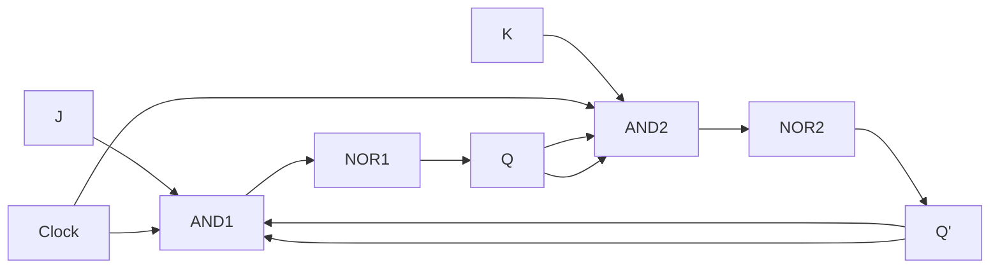

#### Truth Table

| CLK | J | K | Q(t+1) | State |
|-----|---|---|--------|-----------------|
| ↑   | 0 | 0 | Q(t)   | Hold/No Change  |
| ↑   | 0 | 1 | 0      | Reset           |
| ↑   | 1 | 0 | 1      | Set             |
| ↑   | 1 | 1 | Q'(t)  | Toggle          |
| 0/1 | X | X | Q(t)   | No Change       |

#### Characteristic Table

| J | K | Q(t) | Q(t+1) |
|---|---|------|--------|
| 0 | 0 | 0 | 0 |
| 0 | 0 | 1 | 1 |
| 0 | 1 | 0 | 0 |
| 0 | 1 | 1 | 0 |
| 1 | 0 | 0 | 1 |
| 1 | 0 | 1 | 1 |
| 1 | 1 | 0 | 1 |
| 1 | 1 | 1 | 0 |

**Characteristic Equation**: Q(t+1) = JQ'(t) + K'Q(t)

#### Excitation Table

| Q(t) | Q(t+1) | J | K |
|------|--------|---|---|
| 0 | 0 | 0 | X |
| 0 | 1 | 1 | X |
| 1 | 0 | X | 1 |
| 1 | 1 | X | 0 |

---

### 4. T Flip-Flop (Toggle Flip-Flop)

#### Circuit Diagram

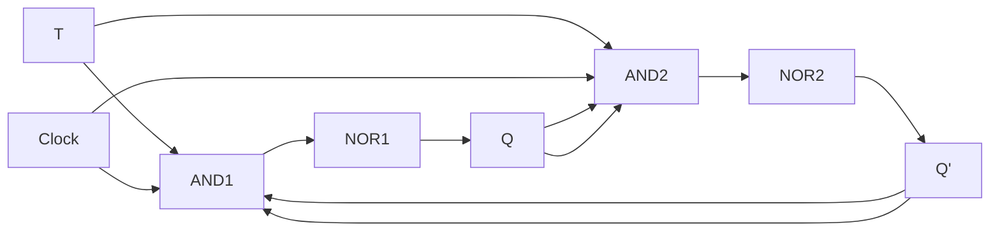

#### Truth Table

| CLK | T | Q(t+1) | State |
|-----|---|--------|-----------------|
| ↑   | 0 | Q(t)   | Hold/No Change  |
| ↑   | 1 | Q'(t)  | Toggle          |
| 0/1 | X | Q(t)   | No Change       |

#### Characteristic Table

| T | Q(t) | Q(t+1) |
|---|------|--------|
| 0 | 0 | 0 |
| 0 | 1 | 1 |
| 1 | 0 | 1 |
| 1 | 1 | 0 |

**Characteristic Equation**: Q(t+1) = TQ'(t) + T'Q(t) = T ⊕ Q(t)

#### Excitation Table

| Q(t) | Q(t+1) | T |
|------|--------|---|
| 0 | 0 | 0 |
| 0 | 1 | 1 |
| 1 | 0 | 1 |
| 1 | 1 | 0 |

---

## Timing Diagrams

### D Flip-Flop Timing Diagram

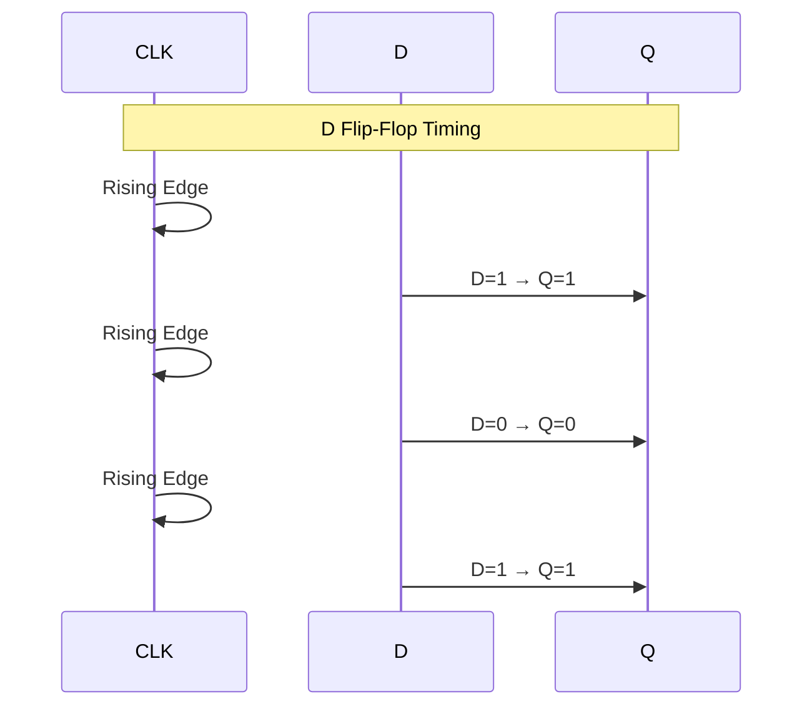

### JK Flip-Flop Timing Diagram

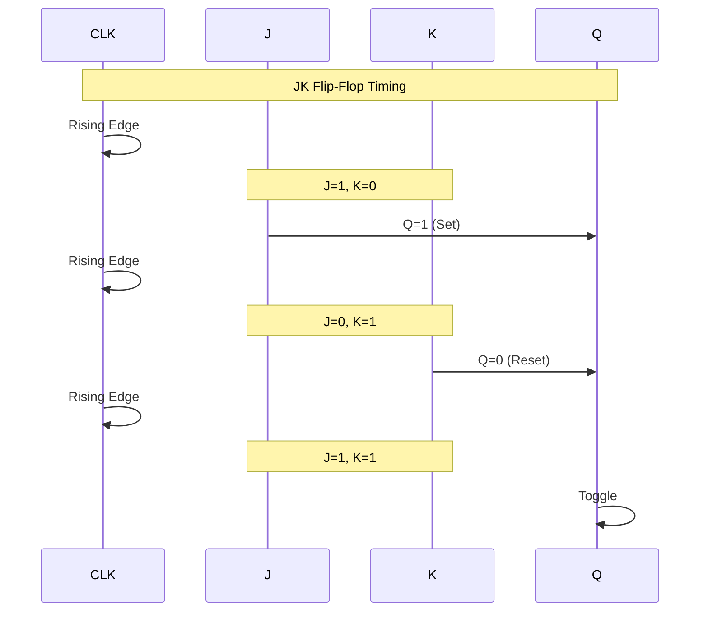

### T Flip-Flop Timing Diagram

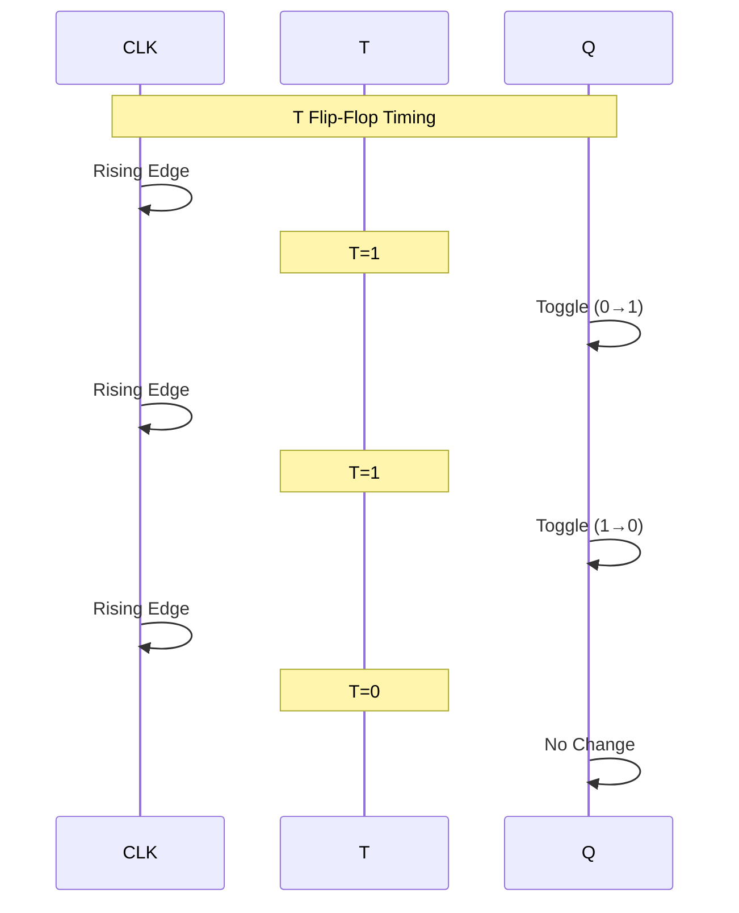

---

## Advantages and Disadvantages of Flip-Flops

### Advantages

1. **Synchronized Operation**: Edge-triggered, works with clock signals
2. **No Race Conditions**: State changes only at clock edges
3. **Predictable Timing**: Easy to analyze and design
4. **Reliable**: Less susceptible to noise and glitches
5. **Easy Cascading**: Can be easily connected in series for counters and registers
6. **Stable States**: Holds data reliably between clock pulses
7. **Standard Design**: Well-established design methodologies

### Disadvantages

1. **Clock Requirement**: Needs clock signal, adds complexity
2. **Power Consumption**: Generally higher than latches
3. **More Complex**: Requires more gates and components
4. **Clock Skew Issues**: Timing problems if clock signals are not synchronized
5. **Setup and Hold Time**: Must meet timing requirements
6. **Slower**: Response delayed until next clock edge
7. **Metastability**: Can occur if timing constraints are violated

---

## Comparison: Latches vs Flip-Flops

| Feature | Latches | Flip-Flops |
|------------------------|--------------------------|---------------------------|
| **Triggering** | Level-triggered | Edge-triggered |
| **Clock Dependency** | Not always required | Always clock-dependent |
| **Sensitivity** | Sensitive to enable signal level | Sensitive to clock edge |
| **Complexity** | Simple (fewer gates) | Complex (more gates) |
| **Power** | Lower | Higher |
| **Speed** | Faster response | Slower (waits for edge) |
| **Use in Systems** | Asynchronous circuits | Synchronous circuits |
| **Race Conditions** | Prone to race conditions | Immune to race conditions |
| **Examples** | SR, D, JK Latches | SR, D, JK, T Flip-Flops |

---

## Applications

### Latch Applications

1. **Temporary Storage**: Buffer registers in asynchronous systems
2. **Level Detection**: Capturing signal levels
3. **Address Latching**: Holding address in microprocessors
4. **Control Circuits**: Simple state machines
5. **I/O Ports**: Data latching in peripheral devices

### Flip-Flop Applications

1. **Counters**: Binary, decade, up/down counters
2. **Shift Registers**: Serial-to-parallel, parallel-to-serial conversion
3. **Memory Elements**: RAM, cache memory
4. **Frequency Division**: Clock division circuits
5. **State Machines**: FSM implementation
6. **Data Synchronization**: Clock domain crossing
7. **Sequence Generators**: Pattern generation

---

## Conversion Between Flip-Flops

Flip-flops can be converted from one type to another using combinational logic gates. The conversion process involves:

1. **Understanding excitation tables** of both source and target flip-flops
2. **Deriving conversion logic** using K-maps or Boolean algebra  
3. **Implementing additional gates** to transform input/output behavior

### Conversion Methodology

**Step-by-Step Procedure:**

1. Create a conversion table with present state (Qn) and next state (Qn+1)
2. Determine required inputs for the source flip-flop
3. Determine required inputs for the target flip-flop
4. Derive logic equations using K-maps
5. Implement the combinational logic circuit

---

### SR to JK Flip-Flop

**Conversion Logic:**
- J = S  
- K = R
- JK eliminates the invalid state (S=1, R=1) that exists in SR

**Implementation:** Direct connection possible as JK is a universal flip-flop that encompasses SR functionality.

---

### SR to D Flip-Flop

**Conversion Logic:**
- D = S
- R = S' (complement of S)

**Truth Table:**

| D | S | R |
|---|---|---|
| 0 | 0 | 1 |
| 1 | 1 | 0 |

**Implementation:** Requires one NOT gate

---

### SR to T Flip-Flop  

**Conversion Logic:**
- T = S ⊕ R (XOR of S and R)
- Requires XOR gate for implementation

---

### JK to SR Flip-Flop

**Conversion Logic:**
- S = J · Q' (J AND NOT Q)
- R = K · Q (K AND Q)

**Implementation:** Requires two AND gates and one NOT gate

---

### JK to D Flip-Flop

**Conversion Logic:**
- D = J · Q' + K' · Q
- Simplified: D = J · Q' + K' · Q

**Truth Table:**

| Q | J | K | D |
|---|---|---|---|
| 0 | 0 | 0 | 0 |
| 0 | 0 | 1 | 0 |
| 0 | 1 | 0 | 1 |
| 0 | 1 | 1 | 1 |
| 1 | 0 | 0 | 1 |
| 1 | 0 | 1 | 0 |
| 1 | 1 | 0 | 1 |
| 1 | 1 | 1 | 0 |

**Simplified:** D = J (when K=0) or D = Q (when J=0, K=0)

---

### JK to T Flip-Flop

**Conversion Logic:**
- T = J · Q' + K · Q  
- T = J ⊕ K (when considering toggle behavior)

**Implementation:** Can use XOR gate or combination of AND-OR gates

---

### D to SR Flip-Flop

**Conversion Logic:**
- S = D · Q'
- R = D' · Q

**Implementation:** Requires two AND gates and one NOT gate

---

### D to JK Flip-Flop

**Conversion Logic:**
- J = D
- K = D'

**Truth Table:**

| D | J | K |
|---|---|---|
| 0 | 0 | 1 |
| 1 | 1 | 0 |

**Implementation:** Requires one NOT gate

---

### D to T Flip-Flop  

**Conversion Logic:**
- T = D ⊕ Q (XOR of D and Q)

**Characteristic Equation:** Qn+1 = D ⊕ Q

**Implementation:** Requires one XOR gate with feedback from Q

---

### T to SR Flip-Flop

**Conversion Logic:**
- S = T · Q'
- R = T · Q

**Truth Table:**

| Q | T | S | R |
|---|---|---|---|
| 0 | 0 | 0 | 0 |
| 0 | 1 | 1 | 0 |
| 1 | 0 | 0 | 0 |
| 1 | 1 | 0 | 1 |

**Implementation:** Requires two AND gates

---

### T to JK Flip-Flop

**Conversion Logic:**
- J = T
- K = T  

**Implementation:** Direct connection of T to both J and K inputs

---

### T to D Flip-Flop

**Conversion Logic:**
- D = T ⊕ Q (XOR of T and Q)

**Truth Table:**

| Q | T | D |
|---|---|---|
| 0 | 0 | 0 |
| 0 | 1 | 1 |
| 1 | 0 | 1 |
| 1 | 1 | 0 |

**Implementation:** Requires one XOR gate with feedback

---

### Universal Flip-Flop Conversions

**JK as Universal Flip-Flop:**

The JK flip-flop can implement any other flip-flop type:

1. **JK to SR:** J=S, K=R
2. **JK to D:** J=D, K=D'
3. **JK to T:** J=K=T

**Practical Notes:**
- JK is most versatile for conversions
- D flip-flop is simplest but requires feedback for T implementation
- SR has invalid state (S=R=1) which limits direct conversions
- T flip-flop requires feedback in most conversions

---

### Conversion Design Examples

#### Example 1: Convert D to T Flip-Flop

**Given:** D flip-flop  
**Required:** T flip-flop behavior

**Solution:**
1. T flip-flop toggles when T=1
2. D must receive: D = T ⊕ Q
3. Circuit: Connect T and Q to XOR gate, output to D input

#### Example 2: Convert JK to D Flip-Flop

**Given:** JK flip-flop  
**Required:** D flip-flop behavior

**Solution:**
1. D flip-flop: Qn+1 = D
2. Connect: J = D, K = D' (using NOT gate)
3. When D=0: J=0, K=1 → Reset
4. When D=1: J=1, K=0 → Set

---

### Conversion Summary Table

| From → To | Additional Logic Required |
|-----------|---------------------------|
| SR → JK | None (direct) |
| SR → D | 1 NOT gate |
| SR → T | 1 XOR gate |
| JK → SR | 2 AND gates, 1 NOT gate |
| JK → D | 1 NOT gate |
| JK → T | 1 XOR or AND-OR gates |
| D → SR | 2 AND gates, 1 NOT gate |
| D → JK | 1 NOT gate |
| D → T | 1 XOR gate + feedback |
| T → SR | 2 AND gates |
| T → JK | None (connect T to J and K) |
| T → D | 1 XOR gate + feedback |

---

## Master-Slave Configuration

Master-Slave flip-flops use two latches in series:

1. **Master Latch**: Captures input when clock is HIGH
2. **Slave Latch**: Transfers data when clock is LOW
3. **Advantage**: Eliminates race-around condition
4. **Operation**: Data passes through master then slave
5. **Edge-Triggered**: Provides true edge-triggered behavior

---

## Key Timing Parameters

### Setup Time (tsu)
- Minimum time data must be stable **before** clock edge
- Ensures data is properly captured

### Hold Time (th)
- Minimum time data must be stable **after** clock edge
- Prevents data corruption

### Propagation Delay (tpd)
- Time from clock edge to output change
- Affects maximum clock frequency

### Clock-to-Output Delay (tco)
- Time from clock edge to valid output
- Important for timing analysis

### Maximum Frequency (fmax)
- fmax = 1 / (tpd + tsu + th + tcomb)
- Where tcomb is combinational logic delay

---

## Summary

### When to Use Latches
- Simple storage requirements
- Asynchronous systems
- Low power applications
- Level-sensitive control needed

### When to Use Flip-Flops
- Synchronous digital systems
- Counters and registers
- State machines
- Memory elements
- Clock-based designs

---

## Resources

- **Digital Design** by M. Morris Mano
- Practice designing sequential circuits
- Understand timing diagrams thoroughly
- Study state machine design
- Analyze setup and hold time violations
- Use simulation tools (Logisim, Multisim)

---

## Practice Problems

1. Design a 4-bit binary counter using JK flip-flops
2. Convert a T flip-flop to D flip-flop
3. Draw timing diagrams for all flip-flop types
4. Analyze setup and hold time requirements
5. Design a sequence detector using flip-flops
6. Implement a shift register using D flip-flops
7. Compare power consumption of latches vs flip-flops
8. Design a frequency divider using T flip-flops

---

## Important Notes

- **Latches** are transparent and level-sensitive
- **Flip-Flops** are opaque and edge-sensitive
- Always check for setup and hold time violations
- Use flip-flops in synchronous designs for reliability
- Master-Slave configuration prevents race conditions
- Clock skew can cause timing failures
- Metastability occurs when timing is violated

---

*Sequential circuits form the basis of all digital memory and state machines. Understanding latches and flip-flops is fundamental to digital system design.*
